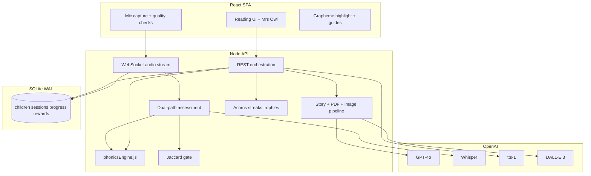

# Properly Full Scaffold

Greenfield build in an empty workspace. Stack matches your write-up: **React 18 SPA**, **Node.js API**, **SQLite (WAL)**, **WebSocket audio**, OpenAI (**GPT-4o**, **Whisper**, **tts-1**, **DALL·E 3**), centralized `phonicsEngine.js`.

## Architecture



## Repo layout

```
ProperlyOpenAI/
  package.json              # workspace scripts
  README.md
  .env.example
  client/                   # Vite + React 18
  server/
    src/
      index.js
      db/
      routes/
      ws/
      services/
      engine/phonicsEngine.js
  shared/                   # optional thin types/constants if needed
```

Monorepo with root scripts: `dev` (API + client), `server`, `client`.

## Core module: `phonicsEngine.js`

Single source of truth used by API assessment, story constraints, and client highlighting:

- All **44 IPA phonemes**
- DfE **Letters and Sounds** phases (2–5 prioritized; Phase 1 awareness stub)
- Grapheme → phoneme maps, CVC/CVCC patterns, tricky words per phase
- UI metadata: tile colors, IPA strips, highlight rules
- Helpers: `getPhaseVocabulary(phase)`, `tokenizeWord(word)`, `isWordAllowed(word, phase)`, `expectedPhonemes(text)`

Client imports a **built/copied** read-only subset (or shared package) so visualization stays in sync with server logic—no duplicated hard-coded phase tables in React.

## Backend (Node)

- **Express** REST + **`ws`** WebSocket on same HTTP server
- **better-sqlite3** with `PRAGMA journal_mode=WAL`
- Schema (minimal but complete for scaffold):
  - `children` (name, interests, phase, acorns, streak, last_read_at)
  - `sessions` (child_id, story_id, status, jaccard_score, started/ended)
  - `stories` (phase, theme, text, illustration_url, pdf_path, metadata JSON)
  - `assessments` (session_id, expected, recognized, phoneme_scores JSON)
  - `rewards` / `trophies` (child_id, type, earned_at)
- Services:
  - `storyService` — GPT-4o constrained generation + temperature/examples; post-filter reject out-of-phase words
  - `illustrationService` — DALL·E 3 child-safe style
  - `ttsService` — Mrs Owl voice (`tts-1`)
  - `assessmentService` — dual path: (1) streamed/chunk heuristics + (2) Whisper fallback
  - `validationService` — Jaccard on word and phoneme sets; threshold pause/retry
  - `pdfService` — A4 PDF with text, illustration, color grapheme tiles, IPA strip
  - `rewardService` — acorns, streaks, trophies on validated completion
- REST endpoints (scaffold-complete):
  - Children CRUD / progress
  - `POST /stories/generate`
  - `GET /stories/:id` + `GET /stories/:id/pdf`
  - Session start/complete
  - Mrs Owl coach `POST /coach` (GPT-4o + optional TTS audio URL)
  - Phonics guide data `GET /phonics/phases/:phase`
- WebSocket `/ws/audio`:
  - Browser sends PCM/webm chunks + session context
  - Server: quality signals, assessment, Jaccard gate, incremental feedback events
  - Retry/recovery messages for dropouts; degrade to Whisper-on-end if stream unstable

## Frontend (React 18 + Vite)

Child-friendly UI (warm, playful, not purple-glow generic AI aesthetic)—brand **Properly**, hero tutor presence **Mrs Owl**:

- Onboarding: child name, interests, starting phase
- Home: streak, acorns, continue reading
- Reading session: story text, grapheme highlighting, live feedback, retry when Jaccard fails
- Mic controls with pre-flight audio quality check (level / silence)
- Mrs Owl coach panel (text + play TTS)
- Phonics guide (phase tiles)
- Rewards / trophies
- Download PDF storybook
- Progress view tied to DfE phases

State: lightweight React context or Zustand; WebSocket client with reconnect.

## Reliability patterns (from your challenges)

| Challenge | Scaffold approach |
|-----------|-------------------|
| Real-time audio | Browser level meter + silence detect; WS heartbeats; chunk retry; Whisper end-of-utterance fallback |
| False positives | Jaccard on words + phonemes; below threshold → pause + “try again” |
| LLM creativity | Strict system prompt + few-shot Phase 2–5 examples + low temperature + engine vocabulary allowlist post-check |

## Config & docs

- `.env.example`: `OPENAI_API_KEY`, ports, Jaccard threshold, TTS voice
- README: inspiration/what/how from your narrative (condensed), setup, architecture diagram, demo script
- Seed data: sample child + Phase 2 story for offline demo if no key (mock mode flag)

## Implementation order

1. Repo bootstrap + SQLite schema + `phonicsEngine.js`
2. Story generation + post-filter + Mrs Owl coach/TTS
3. Reading UI + highlighting
4. WebSocket audio path + dual assessment + Jaccard gate
5. Rewards + progress
6. PDF + DALL·E illustrations
7. Polish README, mock mode, end-to-end happy path

## Out of scope for this scaffold (explicitly deferred)

- Production auth / multi-tenant schools
- Native mobile apps
- Real classroom LMS integrations
- Perfect production STT latency SLAs (scaffold proves the pipeline)

## Default decisions locked in

- **Language/runtime:** JavaScript (not TypeScript) to match `phonicsEngine.js` naming in your write-up; JSDoc on engine public API
- **Phase model:** full Letters and Sounds data in engine from day one; UX flows emphasize Phase 2–3 first
- **Auth:** local single-device profile (no login) for scaffold speed
- **Illustrations/PDF:** generated on story create; cached on disk under `server/storage/`
